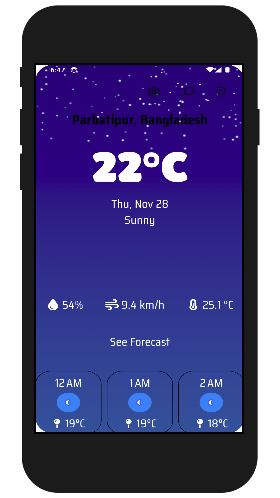
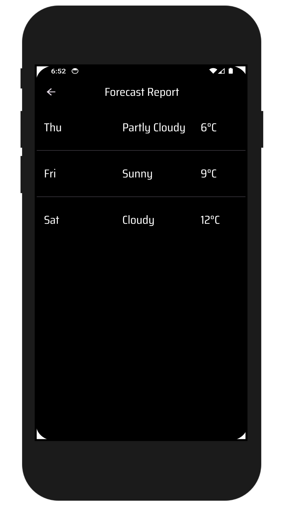
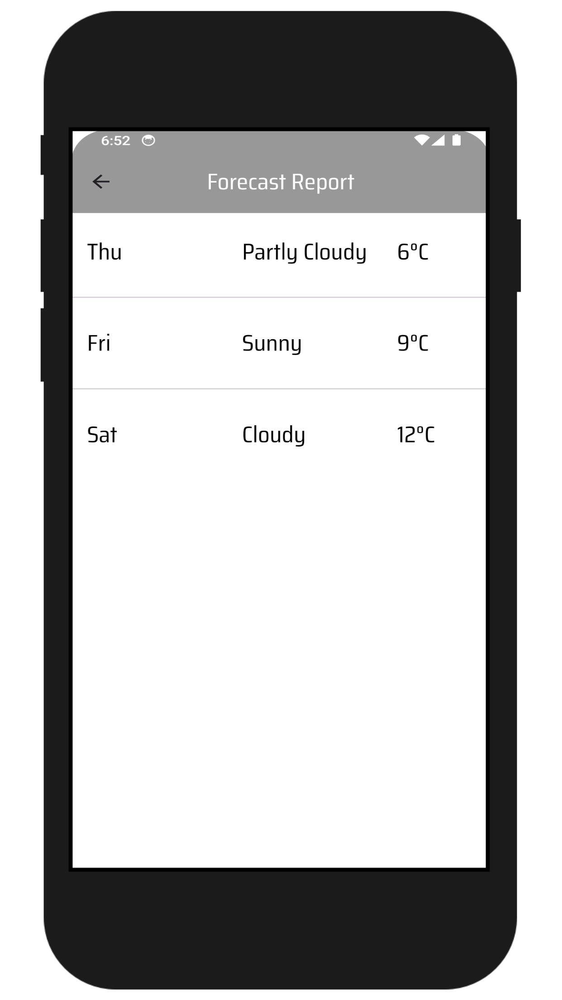
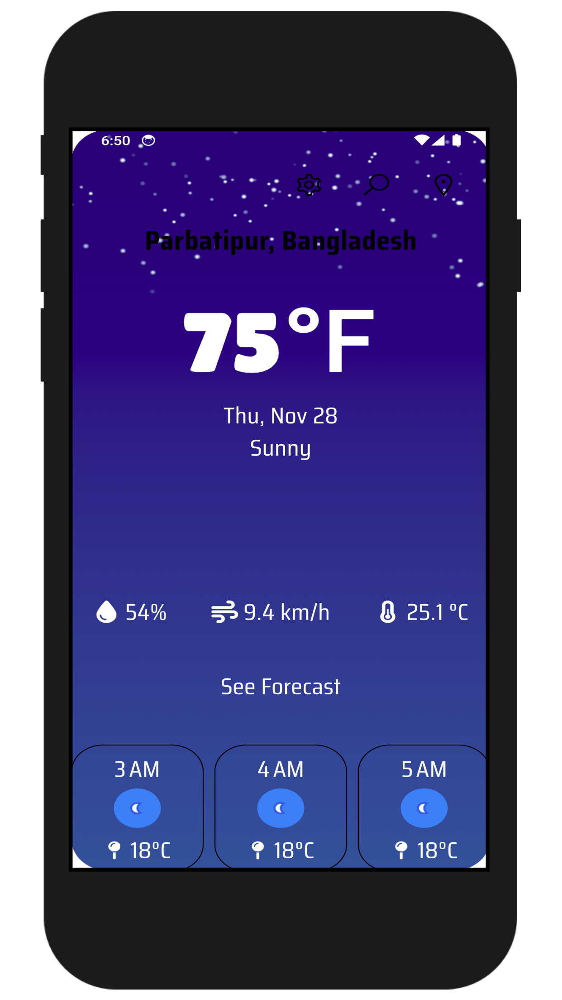
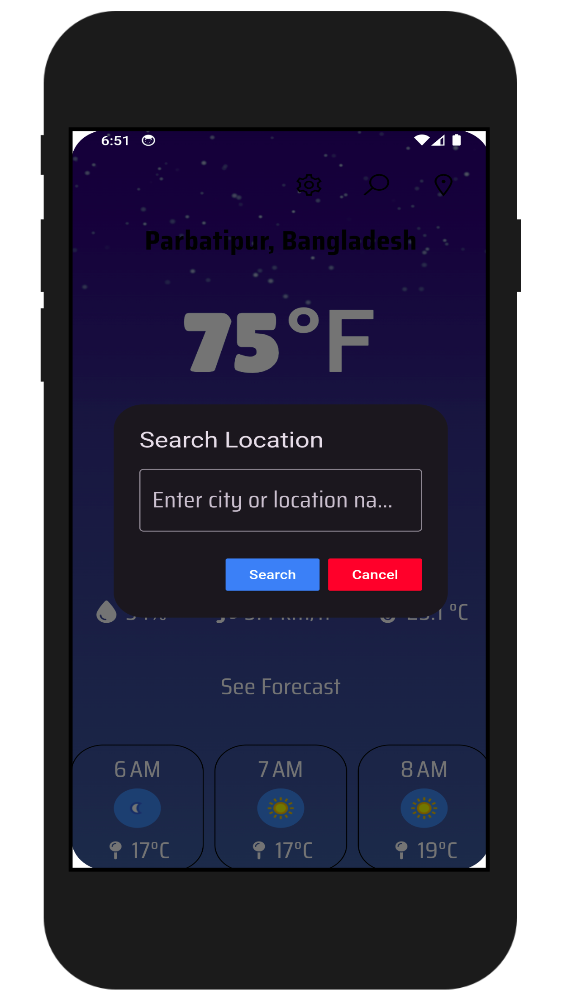
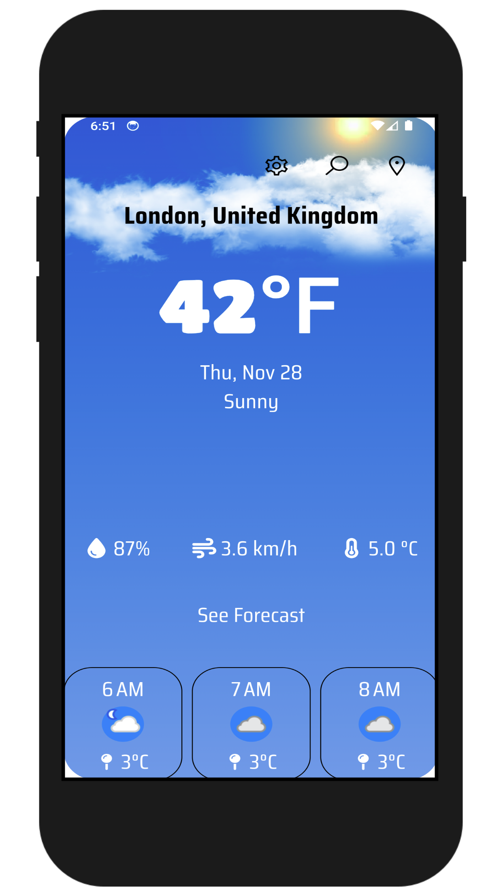
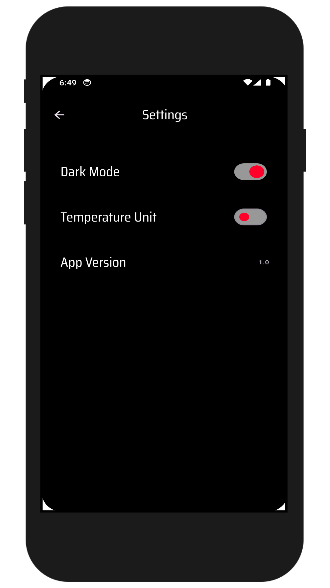
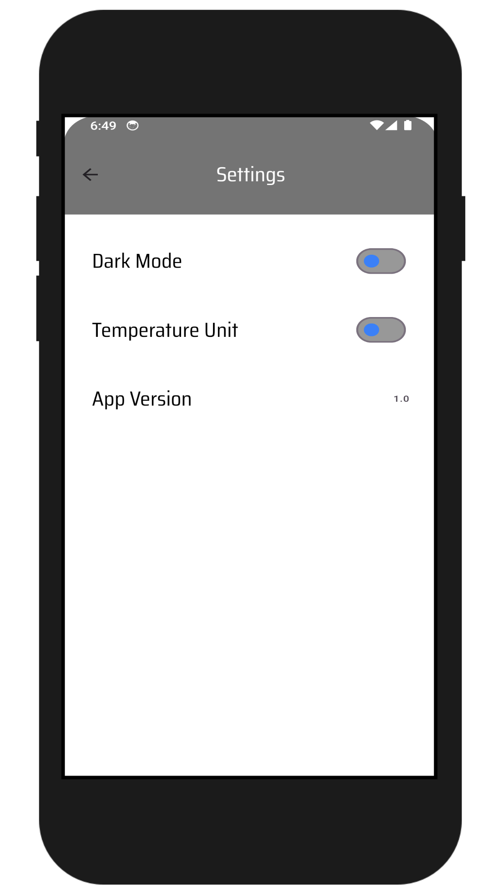

# 🌦️ Weather App 🌍

**A Flutter-based Weather App** that provides real-time weather updates, including location-specific data and customizable settings for an enhanced user experience.

---

## 📋 Features

- **Current Weather Information:**  
  Displays country, location, date, wind speed (kph), feels-like temperature, and humidity.

- **Hourly Forecast:**  
  View detailed weather updates for the next 24 hours.

- **7-Day Forecast:**  
  Get an extended forecast for the upcoming week.

- **Theme Options:**  
  Toggle between **Dark** and **Light** themes.

- **Temperature Units:**  
  Switch between **Celsius** and **Fahrenheit** with ease.

- **Location-Based Updates:**
    - **Search Box:** Enter any location to view its weather.
    - **Current Location:** Click the location icon to get weather updates based on your current GPS location.

- **App Settings:**  
  Easily view the current **app version** in the settings.

---

## 🚀 Installation

1. **Clone the Repository:**
   ```bash
   git clone https://github.com/rabby220/WeatherApp.git
   cd WeatherApp

2. **Install Dependencies::**
   ```bash
   flutter pub get

3. **Install Dependencies::**
   ```bash
   flutter run

---

## 🛠️ Tech Stack
- Flutter (Dart)
- State Management: GetX 
- API Integration: [Weather API Provider Name] 
- Local Storage: [For user preferences like theme and units, if applicable]

---

## 📸 Screenshots
# Screenshots

<p align="center">
  
  
  
</p>

<p align="center">
  
  
  
</p>

<p align="center">
  
  
</p>


---

## 📝 Future Enhancements
- Add more weather details (e.g., UV index, air quality).
- Implement weather alerts and notifications.
- Integrate additional languages for global support.

---

## 💡 How to Contribute

1. Fork the repository.
2. Create a new branch:
   ```bash
   git checkout -b feature-name

3. Commit your changes:
   ```bash
   git commit -m "Add some feature"

4. Push to the branch:
   ```bash
   git push origin feature-name

5. Open a Pull Request.

## 📫 Contact
If you have any questions or suggestions, feel free to reach out via [Email](mailto:fajlarabby220@gmail.com).


